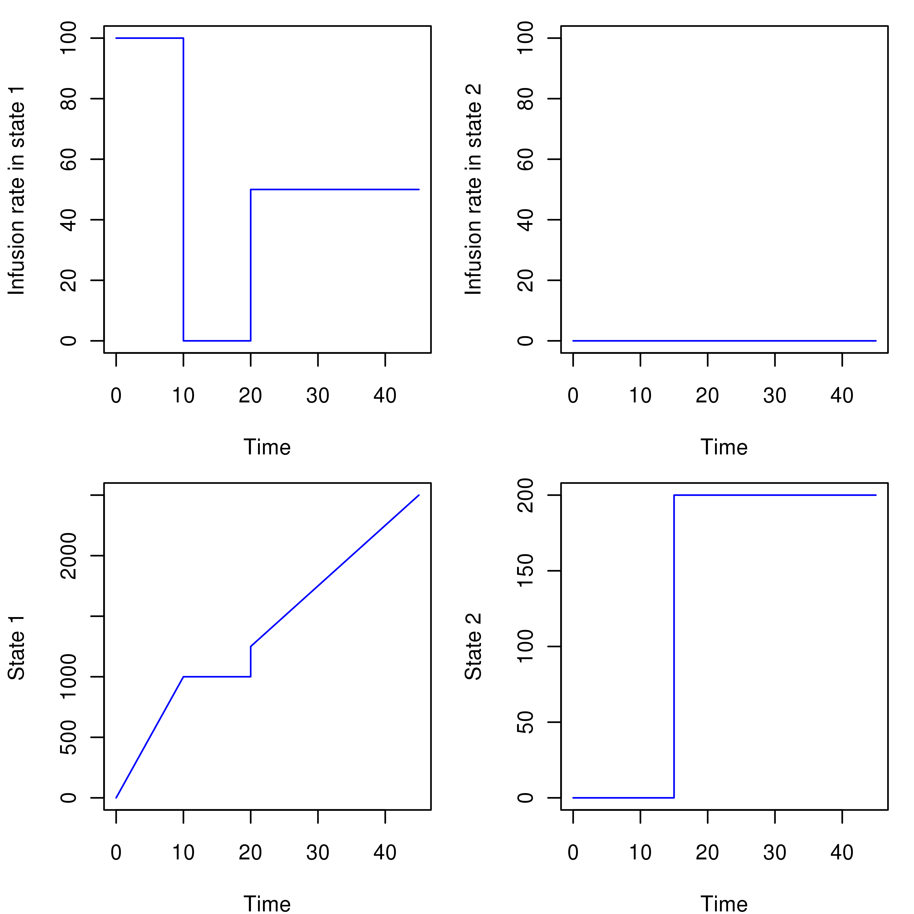
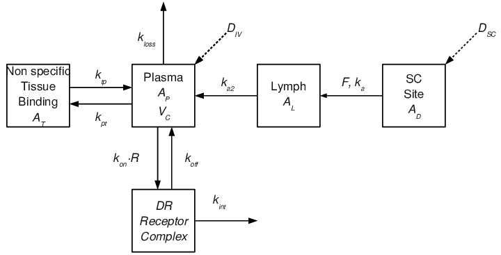
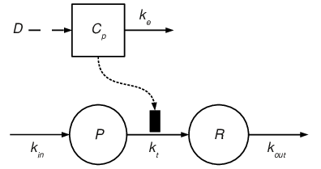
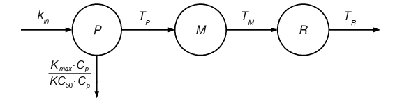
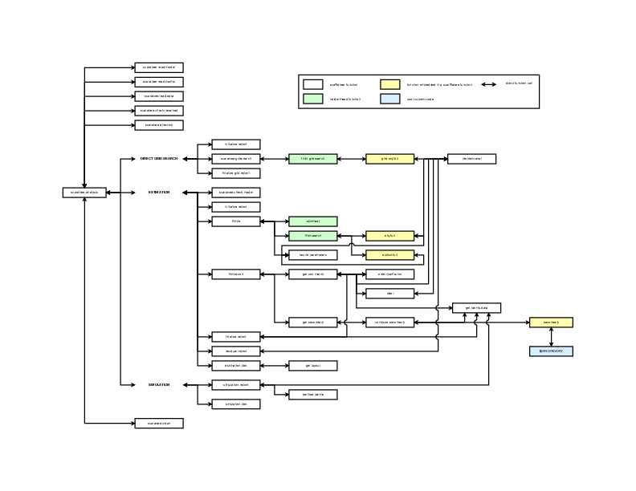
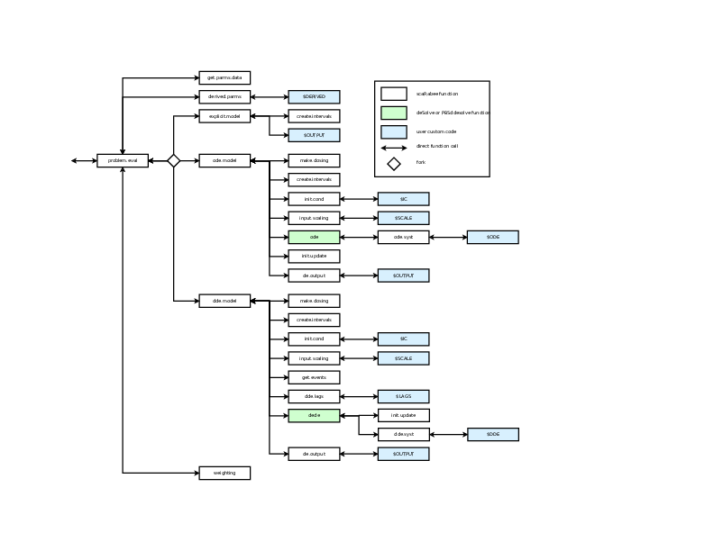

```{r setup, include=FALSE}
knitr::opts_chunk$set(echo = TRUE)
```

```{r, echo = FALSE, message = FALSE}
require(scaRabee)
```

<style>
#TOC {
  background: url("../inst/images/scarabee-favicon-100x100.png");
  background-size: contain;
  padding-top: 100px !important;
  background-repeat: no-repeat;
}
</style>

<br>

# Introduction

`scaRabee` is a toolkit for modeling and simulation primarily intended for the 
field of pharmacometrics. It was initially a R port @Rcitation of `Scarabee`, a
Matlab-based application developed for the simulation and optimization of 
pharmacokinetic and/or pharmacodynamic models specified with algebraic equations,
ordinary or delay differential equations @Bihorel_2009. It is now the only 
version supported and being developed. Since its first release, the `scaRabee` 
package has been improved and now contains functionality which was not present 
in the original Matlab version.

## Preliminary notice

This vignette constitutes a user manual for `scaRabee`. This manual assumes 
that the reader is familiar with the concepts of pharmacokinetic and 
pharmacodynamic modeling and the underlying statistical theories. It is not the
objective of this manual to explain and review those methods and theories. 
Readers who are new to this field are invited to read the excellent introductory
and more advanced books from Gabrielsson and Weiner @Gabrielsson_2007,
Bonate @Bonate_2006 or Ette and Williams @Ette_2007.

The systems analyzed in `scaRabee` must be specified, for most parts, using the
R language and all analyses should be executed within the R environment
in interactive or batch mode. Presentations of the R language are out of the
scope of this manual.


## What's new?

Version 1.1-3 introduces minor changes to `scaRabee` related primarily to the
update of the `neldermead` package. Dosing variables Dx and Rx can now be
provided as derived variables.

## How to obtain scaRabee

`scaRabee` is available at the Comprehensive R Archive Network and also on 
[gihtub](https://github.com/sbihorel/scaRabee). `scaRabee` is distributed under a GNU
General Public License version 3. Please, review the terms of this license
before using this package. 

## Installation and dependencies

This package is available as source archive. You are invited to read Section
6.3 Installing packages from the R Installation and Administration manual 
@Rinstall_2010 for more details on how to install a source package from a
local .zip or .tar.gz file on your system. Model optimization in `scaRabee` (as
described in Section 'Types of analysis performed in `scaRabee`') relies on functions from the `neldermead`,
`optimsimplex`, and `optimbase` packages, which are also distributed 
from CRAN and github as compressed archives or source.

## Credits

`scaRabee` was written by Sebastien Bihorel, alumni of the Paris 5 - Rene 
Descartes University and of the State University of New York (SUNY) at Buffalo,
upon suggestions and contributions from:

* Pawel Wiczling, alumni of SUNY at Buffalo, who shared codes at the basis 
of the first Matlab versions of the fitmle and fitmle.cov functions,
* John Harrold, Post-Doctoral Fellow at SUNY at Buffalo, who provided numerous
advises during the creation of the Matlab version of`scaRabee`,
* Sihem Ait-Oudhia, alumni of the Paris 5 - Rene Descartes University and of 
SUNY at Buffalo, for her suggestions and support.

The `neldermead`, `optimsimplex`, and `optimbase` packages, used
for parameter optimization in `scaRabee`, are R ports of the Scilab modules
of the same names which were developed by Michael Baudin at INRIA (Institut
National de Recherche en Informatique et en Automatique) and now at the 
Digiteo consortium. More information on Scilab can be found at 
[www.scilab.org](https://www.scilab.org).

## Reporting bugs

We welcome bug reports, questions, and suggestions concerning any aspect of 
`scaRabee` functions, documentation, installation, anything... Please email 
them to sb.pmlab@gmail.com.

For bug reports, please include enough information to allow the maintainer to 
reproduce the problem. Generally speaking, that means:

* your version of `scaRabee` and the function(s) or manual involved.
* your version of R and package dependencies.
* hardware and operating system names and versions.
* the contents of any data and model files necessary to reproduce the bug.
* a description of the problem and samples of any erroneous output.
* any unusual options you gave to configure the problem.
* anything else that you think would be helpful.

Patches are also most welcome.

# Analysis types
  
`scaRabee` allows the optimization and simulation of non-linear systems at the 
population and subject levels but does not implement non-linear mixed effects 
modeling. For each subject included in an analysis, `scaRabee` allows users to 
split the analysis problem into subproblems (also referred to as treatments), 
while still defining a unique model. This feature is especially useful when data 
obtained from several dose levels or regimens are fitted simultaneously, because 
it avoids the duplication of algebraic or differential equations usually needed 
to accommodate the different dose levels or regimens.

`scaRabee` allows users to perform three types of analysis: simulations, 
estimations, and direct grid searches.

## Simulation

Simulation runs allow to generate detailed model predictions based upon initial 
parameter values provided by the user. `scaRabee` also produces default overlay
plots of model predictions and actual observations.

## Estimation

Estimation runs allow to optimize model parameters based upon the observations,
the structural model and a residual variability model. Model parameters are 
optimized by the method of the maximum likelihood, more precisely by the 
minimization of an objective function defined as the exact negative log 
likelihood of the observed data, given the model structure and a set of
parameter values. The minimization algorithm is based upon the Nelder-Mead 
simplex method, as implemented by the `fminsearch` function from the 
`neldermead` package. The computation of the data likelihood and the 
covariance matrices of primary and secondary parameters are performed as 
described in the Adapt II software user's manual written by D'Argenio and 
Schumitzky @Dargenio_1997.

The analysis of population data can be performed by naive averaging,
naive pooling, or by the standard two-stage approach @Ette_2007. Note 
that the standard two-stage approach is automated only since version 1.1-0.

## Direct grid search

Direct grid search runs allow to explore the search space of an optimization 
problem around the initial point $x_0$ of parameter estimates. This 
`scaRabee` feature automatically creates a grid of search points selected 
around the initial point and evaluates the objective function at each one of 
these search points. The boundaries of the grid are set either by the lower and 
upper boundaries set by the users, or by a vector of factors $\alpha$ applied 
to $x_0$ as follows: $[x_{0}/\alpha,x_{0}\times\alpha]$. The number $npts$ 
of points evaluated for each parameter (or dimension of the optimization 
problem) can also be defined. The total number of points in the grid is 
$npts^{p_e}$, where $p_e$ is the number of parameters to be estimated. At 
the end of the search, a table sorted by increasing value of the objective 
function is created. 

This table also reports the feasibility of the objective function at each 
particular search point because the grid search is actually delegated to the 
`fmin.gridsearch` function from the `neldermead` package. This function
is a wrapper around `optimbase.gridsearch` from the `optimbase` package,
which assesses the feasibility of a cost function in addition to calculating its 
value at each particular search point. Because `fmin.gridsearch` does not 
accept constraints, the objective function should always be feasible. Additional 
information is available in `optimbase.gridsearch` and 
`?fmin.gridsearch`.

# Getting started

All `scaRabee` analyses are typically conducted in analysis-specific folders
and rely on the presence of a given list of files in this working directory. A
typical `scaRabee` folder, as one created by the `scarabee.new` 
function, contains at least the following files:

* myanalysis.R: the master R script; this file is required to initiate the 
analysis. Section 'Editing of the master scaRabee script' describes which parts 
of the code must be edited.
* data.csv: the data file; this file is a comma-separated table containing the 
dosing and observation data to be used for model simulation or optimization. 
Section 'Editing of the data file' describes how this data must be specified.
* initials.csv: the parameter file; this file is a comma-separated table 
containing the names and values of the model parameters, used for model 
optimization or as inputs for model  simulation. In the former case, the values
provided for each parameters are used as initial estimates for the optimization. 
Section 'Editing of the parameter file' describes how these parameters must be 
specified.
* model.txt: the model file; this file is a text file in which the structural
model, residual variability model, and secondary parameter computations are 
defined. Section 'Editing of the model file' describes the syntax that must be 
applied to edit this file.

While the names of these files correspond to the default assumed by the 
`scarabee.new` function, they can be modified at the user's discretion.
In this manual, the default files names are used for the sake of simplicity. 
Finally, please note that you can add any file needed or not for your analysis 
in your analysis folder. The Sections 'Creation of a new analysis folder' 
through 'Execution of the master scaRabee script' offer a step-by-step 
description of the analysis process. 

## Creation of a new analysis folder

If you start a brand new data analysis, it is recommended that you open an
interactive R session, and use the `scarabee.new` function to create a 
new analysis folder that will contain `myanalysis.R`, `data.csv`, 
`initials.csv`, and `model.txt`. It is recommended that you provide 
all arguments of `scarabee.new` to better set up the new folder:

* `name` controls the name of the analysis, which is used as a base name for 
the master R script file (in place of the default 'myanalysis') and is also
inserted after the \$ANALYSIS tag in the model file (see Section 'Editing of 
the model file'),
* `path` defines the (absolute or relative) path to the directory to be 
created; if the `path` argument is NULL, then it is coerced to `name`, thus 
causing the (tentative) creation of a new folder named as the `name` argument 
in the current working directory,
* `type` defines whether the analysis is a simulation (default), an estimation, 
or a direct grid search run,
* `method` defines if the analysis is to be performed at the population 
(default) or subject level,
* `template` controls which template will be used for `model.txt`; templates are
available for models defined with algebraic ('explicit'), ordinary differential 
equations ('ode', default), or delay differential equations ('dde').

Here is an example of `scaRabee` folder creation:

```{r eval = FALSE}
require(scaRabee)
scarabee.new(name='myanalysis',
             path = 'some/target/directory/',
             type = 'simulation',
             method = 'population',
             template = 'ode')
```

## Creation of new models in an on-going analysis

Alternative models for an on-going analysis might be created in three different 
ways:

* Create copies of the master R script and `model.txt` of interest in the 
current working directory. This method is not recommended but should work as
long as the new master R script is updated appropriately and the string 
following the \$ANALYSIS tag in the new model file is different from the one
used in the original model.
* Create a brand new analysis folder using the method described in Section
'Creation of a new analysis folder'.
* Copy an existing analysis folder to a different location, and make the 
appropriate deletion of analysis subfolders and report files. 

Regardless of the chosen method, most analysis files require some form of 
modification, that are described in Section 'Editing of the data file' through
'Editing of the master scaRabee script'. Symbols and notations used in those 
sections as well as in the `scaRabee` function man pages are summarized below:

| Symbol | Definition                    |
|:-------|:------------------------------|
| $p_{e}$ | Number of parameters to be estimated |
| $p_{f}$ | Number of fixed parameters |
| $p_{s}$ | Number of secondary parameters to be estimated |
| $p_{d}$ | Number of derived parameters |
| $c$ | Number of covariates in the dataset |
| $n$ | Number of subjects in the dataset |
| $k_{i}$ | Number of subproblems for the $i^{th}$ subject  |
| $b_{ij}$ | Number of bolus events in the $j^{th}$ subproblem for the $i^{th}$ subject |
| $f_{ij}$ | Number of infusion events in the $j^{th}$ subproblem for the $i^{th}$ subject |
| $d_{ij}$ | Number of dosing events in the $j^{th}$ subproblem for the $i^{th}$ subject ($b_{ij}$+$f_{ij}$) |
| $m_{ij}$ | Number of observation times in the $j^{th}$ subproblem for the $i^{th}$ subject |
| $s$ | Number of system states  |
| $o$ | Number of system outputs |
| $l$ | Number of delays defined for a solution of a system of delayed differential equations |

## Editing of the data file
  
The data file (named `data.csv` by default) contains the dosing information
and endpoint measurements to be modeled or matched against a model simulation. 
It is required for any type of run. The `scaRabee` data files adopt similar 
structure and standards as those used in programs commonly used in 
pharmacometrics, such as NONMEM @NONMEM_7, S-SADAPT @Sadapt, or 
MONOLIX @Kuhn_2005.

The data must consist of a time-ordered series of dosing and observations events
specific to each subproblem (or treatment; see below) of each subject included 
in the dataset. Blocks of subject/treatment specific data must simply be stacked 
one after the other. The dataset must respect a tabulated, comma-separated value,
format and can be edited in any text editor or spreadsheet. All `scaRabee` data
files can be saved as any user-defined base name; however, the .csv extension is 
compulsory. The content of the data file must be a full rectangular table, with 
the following structure:

* All data variables must be stored in specific columns, each having a 
unique header. A series of variables with reserved names and expected content
must be present, but users can add any number of custom (usually numerical) 
variables. The names and the meanings of the variables required in any 
`scaRabee` dataset are provided in the following listing, which also includes 
one useful but optional variable:

    + **OMIT** (optional) omission flag. Only the data records with the OMIT
    variable set to 0 are included in the analysis. The OMIT variable is coerced
    to integer numbers by `scaRabee`.
    + **ID** subject identifier. A sequence of unique integers starting at 1 is 
    expected to distinguish the subjects in the dataset. The ID variable is 
    coerced to integer numbers by `scaRabee`.
    + **TRT** subproblem identifier. This variable must contain integer numbers 
    in **{increasing order from 1 to $k_{i}$, the total number
    of subproblems for the $i^{th}$ subject. If the user decides to define
    different subproblems for one or more individuals, all subproblems are 
    evaluated separetely, but all contribute to the value of objective function 
    for this(ese) individual(s). This feature typically allows users to define 
    simpler systems when modeling different dose levels/regimens, as it avoids 
    e.g. the duplication of the system equations to accomodate data collected at
    multiple dose levels, or the need for a system reset between to treatment 
    period. Therefore, the TRT variable is indistinctly referred to as the 
    subproblem or treatment variable in this manual. All records with a similar 
    TRT value will be considered as part of the same subproblem. The TRT 
    variable is coerced to integer numbers by `scaRabee`.
    + **TIME** independent variable. It represents the time since the first 
    event; therefore, TIME should be 0 for the first (dosing or observation) 
    record of each unique treatment of each subject. If this is not the case 
    for at least one treatment for one subject, the dataset is processed by
    `scaRabee` and a new dataset including the calculated time since first
    event is saved to the working directory and used for the analysis.
    + **AMT** amount variable. This variable is used to define dosing events in
    combination with the RATE, CMT, and TIME variables. For
    each dosing record, the value set for the AMT variable represents the dose
    administered at the TIME for the record and assigned to the system state 
    defined in the CMT variable (see below). The content of the AMT variable is 
    ignored for observation records.
    + **RATE** rate variable. This variable is used to define dosing events in
    combination with the AMT, CMT, and TIME variables. For each dosing record,
    the value set for the RATE variable reflects the rate at which the dose 
    AMT is administered into the system state CMT (see below). The RATE variable
    can be set to:
    
        - **0** to indicate an instantaneous input into the system,
        - **any value > 0** to define the rate of a zero-order input into the system,
        - **-1** to request the estimation of the rate of a zero-order input 
        into the system, and
        - **-2** to request the estimation of the duration of a zero-order input 
        into the system.  
    The user cannot request the estimation of the duration for one record, and
    the estimation of the rate for another: -1 and -2 are mutually exclusive 
    across the dataset.
    + **CMT** compartment variable. This variable represents the system state 
    (*i.e.* a compartment in the standard representation of system in
    pharmacometrics) associated to a dosing record. The CMT variable is ignored
    for observation records. The CMT variable is coerced to integer numbers by 
    `scaRabee`.
    + **EVID** event identifier. This variable is used to define the type of 
    record/event. The EVID variable is set to:
        
        - **0** for observation records, and to
        - **1** for dosing records.  
    The EVID variable is coerced to integer numbers by `scaRabee`.
    + **DV** dependent variable. This variable represents the observed value 
    associated with the record. This value assigned to this variable is ignored
    for dosing records.
    + **DVID** dependent variable. This variable represents the model output 
    (see Section 'Editing of the model file') associated to an observation record. Although
    DVID could be missing for dosing events and is ignored by `scaRabee`, if a 
    value is provided, this value must be 0. The DVID variable is coerced to 
    integer numbers by `scaRabee`.
    + **MDV** missing dependent variable. This variable must be set to 1 for
    dosing records and to 0 for observation records that are to be included in 
    the analysis dataset. Observation records with a DVID value other than 0 are
    excluded. The DVID variable is coerced to integer numbers by `scaRabee`.
* Any other variable provided in the data file is considered as a covariate.
  The total number $c$ of covariates are available for use in selected 
  blocks of code in the model file (see Section 'Editing of the model file').
* Record values set to . or NA are considered missing information by 
  `scaRabee`.
* All data files must contain at least the header line and two records per
  subproblem for each subject, indicating the beginning and the end of the
  observation intervals.

NONMEM users must be warned that several data standards and variables are not 
implemented in `scaRabee`, *e.g.* all records set with EVID of 2, 3, or 4 
are ignored by `scaRabee`, and the CONT, ADDL, II, and SS variables are 
considered as covariates.


## Editing of the parameter file

The parameter file (named `initials.csv` by default) contains the 
information about the primary model parameters. Derived parameters, *i.e.*
parameters that are needed for model computations but do not need to be 
estimated, can be specified in the \$DERIVED or \$OUTPUT blocks in the model 
section. Secondary parameters, *i.e.* parameters that are typically not 
needed for model computations but fro which precision statistics are required, 
can also be defined in the model file using the \$SECONDARY block of code.

This parameter file is required in all types of runs, and can be edited
in any text editor or spreadsheet. All parameter files must
respect the comma-separated values format but can be saved under any
user-defined name (the .csv extension is compulsory though). The content of
parameter files must be provided as a full $(p_e + p_f + 1) \times{} 6$ 
rectangular table (where $p_e$ and $p_e$ are the numbers of fixed and 
estimated parameters), with the following structure:

* The first line must contain the headers of each column of your data table. 
This line is provided in the original `initials.csv` and should typically not
be modified.
* There must be 6 columns, ordered as follows:  
Parameter, Type, Value, Fixed, Lower bound, Upper bound  
where Parameter, Type, and Value are the columns of parameter names, types and
values, Fixed is the column indicating whether a given parameter should be
estimated or fixed in an estimation analysis, and Lower bound and Upper bound
are the columns defining the range of values that a given parameter could
take.
* Each line must contain 6 elements separated by commas. There cannot be any 
missing data in this table.
* The Parameter column can contain numbers or strings of characters, 
representing the name of your model parameters (numbers will be handled as 
strings of characters).
* The Type column must contain single characters, indicating the type of each 
single parameter. There is four types of variables in Scarabee, so only four 
authorized characters:
    + **P** indicates that the parameter is a structural model parameter.
    + **L** indicates that the parameter is a delay. This category exists for
    the user convenience in the definition of model with delayed differential
    equations.
    + **IC** indicates that the parameter is used to define an initial
    condition of a differential equation. This category is a legacy of the 
    original Scarabee Matlab code. It exists for the user convenience in the 
    definition of model with delayed differential equations but is handled 
    exactly the same way as parameters of type 'P'.
    + **V** indicates that the parameter is used to specify the residual
    variability model.
* The Value column must contain real numbers, representing the values taken by 
the parameters.
* The Fixed column must contain either 0's or 1's, indicating whether a parameter
should be fixed (1) or estimated (0) during an estimation analysis. This column
has no impact on simulation runs.
* The Lower and Upper bounds must contain real numbers, representing the range 
of values that parameters can take. The optimization algorithm implemented in 
`scaRabee` forces all estimated parameters to remain within these defined ranges.
* All parameter files must contain at least a header line and one parameter 
definition line.

## Editing of the model file

The model file (named `model.txt` by default) is a text file in which users 
can specify the structural model, residual variability model, and secondary 
parameter computations. The model file is required for all types of analysis. It
can be modified in any text editor and saved under any user-defined name.

The model file implements a tag-based syntax similar to the one used in NM-TRAN
control streams @NONMEM_7, S-ADAPT-TRAN @sadapt_tran or MONOLIX 
@Kuhn_2005 model files. Tags are defined as strings of characters starting 
by the \$ symbol followed by a keyword. At the exception of \$ANALYSIS, each tag
of the listing below marks the beginning of a block of R code defining one 
particular component of the evaluated system. Because of these tags, `scaRabee` 
model files cannot be interpreted directly by R; their content must first be 
parsed by `scaRabee`, before each block of R code could be evaluated at 
relevant stages of the analysis process. Within those blocks of code, users can 
call any R function that would be available in their work space.

Upon creation of a new analysis folder, the model file is pre-filled with the 
tags that are appropriate and required for the specified category of model. The 
complete list of tags required for each category of model is below

* explicit model:  
\$ANALYSIS  
\$OUTPUT  
\$VARIANCE  
\$SECONDARY
* ode model:  
\$ANALYSIS  
\$DEREIVED  
\$IC  
\$SCALE  
\$ODE  
\$OUTPUT  
\$VARIANCE  
\$SECONDARY
* dde model:
\$ANALYSIS  
\$DEREIVED  
\$IC  
\$SCALE  
\$LAGS  
\$ODE  
\$OUTPUT  
\$VARIANCE  
\$SECONDARY

As stated above, users can modify the newly created file in any text editor. 
Note that any tag keyword could be abbreviated to the first three letters of the
keyword, except for \$IC. When a analysis is started (see Section 'Execution of the master scaRabee script'),
the model file is read, parsed, and checked by `scaRabee`. If requirements are
not met, the analysis stops and users are invited to check the content of the 
model file. Note that `scaRabee` determines the category of structural model by
scanning the content of the file for the \$ODE and \$DDE tags: if the \$ODE tag 
is detected, the model is assumed to be defined with ordinary differential 
equations; if the \$DDE tag is detected, the model is assumed to be defined with 
delay differential equations; if both tags are not detected, the model is 
assumed to be defined with algebraic equations. The \$ODE and \$DDE tags cannot 
coexist within the same model file.

### \$ANALYSIS

The \$ANALYSIS tag allows users to provide a name to the analysis, which is used
to name the folder created to store the results of the analysis (see Section 
'Execution of the master scaRabee script') and the analysis report files. The name extracted by `scaRabee`
is the first word following the tag.

The \$ANALYSIS tag must be present in all model files, regardless of the 
category of models.

### \$DERIVED

The \$DERIVED tag is specific to and required for structural models specified 
with ordinary or delay differential equations. It allows users to define derived 
parameters which could be called later within the \$ODE or \$DDE blocks of code. 
Within the \$DERIVED block, users can call any primary parameter defined in the 
parameter file and any covariate name to define new objects. Only the new R 
objects created in the \$DERIVED block will be considered as secondary 
parameters; in other words, all modifications of a primary parameter will be 
ignored. Furthermore, users can choose to leave this block of code empty, if no 
derived parameter is needed.

Although users could choose to define derived parameters within the \$ODE or 
\$DDE blocks, it is computationally more efficient to define them in the 
\$DERIVED block, as this block of code is only evaluated once for each model 
evaluation, while the \$ODE or \$DDE blocks of code are evaluated up to several 
thousands of times.

Note that the \$DERIVED tag is not required (and actually ignored) for models 
specified with algebraic equations, because derived parameters could be defined 
within the \$OUTPUT block without loss of computation efficiency.

### \$IC

The \$IC tag is specific to and required for structural models specified with 
ordinary or delay differential equations. It allows to define the initial 
conditions of the system of differential equations. Users can call any primary 
or derived parameters within the \$IC block.

`scaRabee` expects the creation of the `init` object, which must be a 
vector containing as many elements as there are states in the system of 
differential equations.

### \$SCALE

The \$SCALE tag is specific to and required for models specified with ordinary
or delay differential equations. It allows users to scale any instantaneous or
continuous inputs into the system. This is particularly useful when the 
dimensions of the inputs and the associated stated are different, which is the 
case when a dose of drug in mass (g) or amount (mol, IU) is assigned to a state 
modeled as a concentration (g/L, mol/L or IU/L). Users can call any primary or 
derived parameters within the \$SCALE block.

`scaRabee` expects the creation of the `scale` object, which must be a 
scalar or a vector containing as many elements as there are states in the system
of differential equations. Consequently, all inputs into a given system state 
will be scaled identically.

### \$LAGS

The \$LAGS tag is specific to and required for structural models specified with
delay differential equations. It allows users to define the delays at each the 
system of differential equations should be evaluated. Users can call any primary 
parameter and any derived parameter to define delays within the \$LAGS block.

All primary parameters of type 'L' and all new R objects created in the 
\$LAGS block will be considered as delays. All modifications of a primary or 
derived parameter will be ignored, so users cannot directly set primary or 
derived parameters as systems delays. Except for the parameters of type 'L', all
delay parameters must be derived from previous parameter and be given new names.

Users must define at least one system delay (either as a primary parameter of
type 'L' or as a new R object inside the \$LAGS block) when the structural 
model is defined by delay differential equations.

### \$ODE

The \$ODE tag is specific to and required for structural models specified with 
ordinary differential equations. It allows users to define the system of 
differential equations. The parameters available to users within the \$ODE block 
are:

* the primary parameters,
* the derived parameters,
* $t$, the time of evaluations of the system,
* $a_1$, ..., $a_s$, the values of the system states at time $t$, where $s$ is 
the total number of states, and
* any covariate name. However, by default, `scaRabee` does not interpolate the 
covariate data at time $t$. Users might want to call the `approx` function for 
this purpose (see `?approx`).

`scaRabee` expects the creation of the `dadt` object, a $1 \times s$ matrix of
system states. Note that it is not necessary to include exogenous inputs 
(boluses and infusions) into the system of differential equations, this is 
automatically done by the code.

### \$DDE

The \$DDE tag is specific to and required for structural models specified with 
delay differential equations. It allows users to define the system of 
differential equations. The parameters available to users within the \$ODE block 
are:

* the primary parameters,
* the derived parameters,
* $t$, the time of evaluations of the system,
* $a_1$, ..., $a_s$, the values of the system states at time $t$, where
$s$ is the total number of states,
* $alag.lag_1$, ..., $alag.lag_l$, the vector of system states at time $t-lag_1$,
..., $t-lag_l$, where $l$ is the total number of delays defined in the \$LAGS 
block of code. To access to the value of a particular system state at a 
particular delay, users must subset the appropriate $alag.lag_i$ vector: *i.e.* 
$alag.past[3]$ would extract the value of the 3$^{rd}$ system state at a delay 
named `past`, and
* any covariate name. However, by default, `scaRabee` does not interpolate the 
covariate data at time $t$. Users might want to call the `approx` function for
this purpose (see `?approx`).

`scaRabee` expects the creation of the `dadt` object, a $1 \times s$ matrix of 
system states. Note that it is not necessary to include exogenous inputs 
(boluses and infusions) into the system of differential equations, this is 
automatically done by the code.

### \$OUTPUT

The \$OUTPUT tag must be present in all model files, regardless of the category 
of models. It allows users to defined the output(s) of the structural model.

In models defined with algebraic equations, the \$OUTPUT block is the place 
where the derived parameters and the structural model should be defined. The 
parameters available to users within the \$OUTPUT block are:

* the primary parameters,
* $times$, the vector of unique times of observations (or simulated 
    observations),}
* $bolus$ and $infusion$, the data frames of bolus and infusion dosing records 
extracted from the data file, and
* any covariate data. Note that it is only necessary to interpolate the covariate
data for simulation or direct grid search runs, as covariate data should be 
available at any observation time in estimation runs.

In models defined with ordinary or delay differential equations, the \$OUTPUT 
block is the place to define the model output using the predictions from
the integration of the system of differential equations. The parameters 
available to users within the \$OUTPUT block are:

* the primary parameters,
* the derived parameters,
* $times$, the vector of unique times of observations (or simulated observations),
and
* $f$, the $s \times{} m_{ij}$ matrix of system state predictions, where $m_{ij}$
is the total number of observations in the $j^{th}$ subproblem for the $i^{th}$ subject.

`scaRabee` expects the creation of the `y` object, which must be a 
$o \times{} m_{ij}$ matrix, where $o$ is the number of system outputs. 
For any type of run, the data records set with a DVID value of *dvid* will 
be matched against the $dvid^{th}$ system output. Therefore, the maximum value
of the DVID variable in the dataset must be $o$.

### \$VARIANCE

The \$VARIANCE tag must be present in all model files, regardless of the 
category of structural model. The presence of a \$VARIANCE tag is required for 
types of runs, except for simulations. The \$VARIANCE block allows users to 
define the residual variability models associated with each structural model 
outputs. The parameters available to users within the \$VARIANCE block are:

* the primary parameters,
* the derived parameters,
* $y$, the $o \times{} m_{ij}$ matrix of structural model predictions, and
* $ntime$, a scalar which value is set to $m_{ij}$.

`scaRabee` expects the creation of the `v` object, which must have exactly
the same dimension as the `y` object created in the \$OUTPUT block of code. 
`v` represents the matrix of variance associated with each model prediction.
Typical residual variability models are (assuming $o=1$):

* additive variability model with variance 1

```{r eval=FALSE}
v <- rbind(ones(1,ntime))
```

* additive variability model with estimated or fixed standard deviation,
  *SD*:

```{r eval=FALSE}
v <- rbind((SD^2)*ones(1,ntime))
```

* coefficient of variation model with estimated of fixed standard deviation, *CV*:

```{r eval=FALSE}
v <- rbind((CV^2)*(y[1,]^2))
```

* additive and constant coefficient of variation model with estimated or fixed 
standard deviations, *SD* and *CV*:

```{r eval=FALSE}
v <- rbind((SD^2)*ones(1,ntime) + (CV^2)*(y[1,]^2))
```

### \$SECONDARY

The \$SECONDARY tag is optional for all model files, regardless of the category 
of structural model or run type. It allows users to define $p_s$ secondary 
parameters for which associated statistics must be computed (typically precision
and parametric confidence interval). The only parameters available to users within 
the \$SECONDARY block are the primary parameters. Only the new R objects 
created in this block will be considered as secondary parameters; in other words, 
all modifications of a primary parameter will be ignored. Furthermore, users can 
choose to leave this block of code empty, if no secondary parameter should be 
computed.


## Editing of the master scaRabee script
  
The master `scaRabee` script (named `myanalysis.R` by default) is the R
script that you must execute to perform any analysis. You must edit several 
lines location in a specific section of the file (from line 21 to line 57, or 60
if 'dde' was selected as a template  when `scarabee.new` was called) to 
define the settings of your analysis. Any other line of this file should 
typically not be modified. Commented lines within the user-editable section 
explain what and how variable(s) should be defined.

* Line 25: users can choose to define a working directory by adding a valid path
within the `setwd` function. This is optional but recommended if users work in 
an interactive R session. If provided, the path to the working directory must 
contain the files specified in the `files` list (see below).
* Lines 34-36: the `data`, `param`, and `model` levels of the `files` list are 
character variables defining the names of the files where your data, parameters,
and model are respectively defined. The default content of these levels matches 
the name of corresponding files created by `scarabee.new`. Users can change those
default names.
* Line 39: the `runtype` variable is a character variable, defining if the 
analysis is an estimation, a simulation, or a direct grid search. Any other 
character string than 'estimation', 'simulation', or 'gridsearch' will cause an 
early termination of the run and the display of an error message to the console
or log file.
* Line 42: the `method` variable is a character variable, defining the scope of
the analysis. It must be set to 'subject' or 'population'. Any other character 
string will cause an early termination of the run and the display of an error 
message to the console or log file.
* Line 44: the optimization algorithm is designed to return an infinite
objective function value in case the computation of the objective function at a 
given point of the multi-dimensional search space returns an error message. This
is meant to prevent R from stopping the optimization process. Unfortunately,
this will also happen if an execution error occurs during the evaluation of the 
model or the residual variability functions. The `debug` variable allows users 
to shut down this feature, and identify potential syntax or variable dimension 
problems in your model or residual variability files. The `debug` variable is a
logical that can only take TRUE or FALSE as value.
* Lines 49-50: `estim` is a list with two levels, `maxiter` and `maxfunc`, 
defining the maximum number of iterations and function evaluations during an 
estimation run. Both must be scalar integers. The default values are 500 and 
5000, which should typically allow user's problem to converge to a stable point 
of the search space.
* Lines 54-55: the `npts` and `alpha` are variables specific to direct grid 
search runs. `npts` must be an integer greater than 2 and defines the number of 
points that the grid should contain per dimension (*i.e.* variable model 
parameter). `alpha` must be a scalar or a vector of real numbers greater than 1,
which give the factor(s) used to calculate the range of evaluation for each 
dimension of the search grid (see `?scarabee.gridsearch` for more details). If 
`alpha` is set to NULL, the lower and upper boundaries set in the parameter 
file are used to define the range of evaluation for each dimension of the grid.

## Execution of the master scaRabee script
  
Once all necessary files have been edited, the analysis can be performed by
executing the master R script. This can be done in two ways:

* from an interactive R session: we recommend that you set the working directory
as the path to the analysis folder both in the R session and in the master 
script (see Section 'Editing of the master scaRabee script'). Then, type:
`source('myanalysis.R')`.  
You will be asked whether or not you want to change the working directory, 
press ENTER if this is not the case. At the end of the run, press ENTER when 
prompted to display the different plots generated by `scaRabee`.
* from a shell or dos window: navigate to the directory containing the master R
file of interest, then run the analysis by typing: `R CMD BATCH myanalysis.R`  
You may add any option you see fit.

In both modes, `scaRabee` creates a new folder in the working directory which
name has the following structure: <myanalysis>.<type>.\#  
where <myanalysis> is the string of character directly following the \$ANALYSIS 
tag in the model file, <type> is 'est' for estimation runs, 'sim' for 
simulation runs, 'grid' for direct grid search runs,  and \# is a two-digit
integer.

At the exception of the .Rout file, all run outputs are stored in the newly 
created folder. Additionally, a subfolder called 'run.config.files' is created 
to backup all original analysis files (`data.csv`, `initials.csv`,
`model.R`, and `myanalysis.R`).

In interactive mode, the run progression will be reported to the console, while 
it is stored to a log file in batch mode. Upon successful completion of the run, 
a termination message is reported and graphical outputs and ASCII text reports 
are produced. Most errors happening during the execution of the master R 
script should stop the run and prevent the creation or the finalization of the 
graphs and report files. Instead, an informative message should be displayed.

**Simulation runs**

Upon successful completion of the run, you should be able to see (in interactive
mode) as many figures as the number of subject-subproblem combinations (see 
Section 'Scope of analysis' for more details about how the scope of analysis 
impacts this number). Those overlay figures represent the predicted changes in
all selected outputs on top of the observed data. As stated above, all figures 
are stored in the newly created folder.

A file called `<myanalysis>.simulation.csv` file is also saved in the same
folder. This file lists the values taken by the model outputs at >1001 points
within the studied time interval (typically from the minimum dose event or
observation time to the maximum observation time), for each subproblem of each 
subject (see Section 'Scope of analysis' for more details about the impact of the 
scope of analysis on this file).

**Estimation runs**

Upon successful completion of the run, a figure summarizing the changes in the 
objective function and the estimated parameter values as a function of the 
iteration number is created for each subject and stored in the newly created 
folder. A overlay figure of model predictions and observed data, and a figure 
showing 4 goodness-of-fit plots (predictions vs observations, weighted residuals 
vs time, weighted residuals vs observations, weighted residuals vs predictions) 
for each subproblem of each subject are also created and stored in the same 
folder (see Section 'Scope of analysis' for more details about the impact of the scope 
of analysis on these plots). Starting on `scaRabee` version 1.1-0, those 
figures are not displayed on screen when the analysis is run in interactive 
mode.

A file called `<myanalysis>.report.txt` file is also saved in the same
folder and provides, for each subject in the analysis, a summary of the estimation
run, a summary table of final parameter estimates associated with precision
statistics expressed as a coefficient of variation and a confidence intervals 
(calculated as described in @Dargenio_1997), the matrices of covariance 
and correlation for primary parameters, plus a summary table of computed 
secondary parameters associated with coefficient of variation and confidence 
intervals (calculated as described in @Dargenio_1997).

Moreover, a file called `<myanalysis>.iterations.csv` is saved in the
folder and provides, in a tabulated format, the values of objective function and
estimated parameters obtained at all iterations for each subject.

A file called `<myanalysis>.predictions.csv` is also saved in the folder 
and provides the values of observations, predictions, residuals, variances, and 
weighted residuals for each non-missing observation time, stacked
by subject, subproblem, and model output.

Finally, a file called `<myanalysis>.estimates.csv` is also saved in the 
folder and summarizes the final parameter estimates for each subject included in 
the analysis. This file could be helpful to calculate statistics of distribution
of the different parameters in the analysis population.

**Direct grid search runs**

Direct grid search runs include two main steps: the actual grid search, followed 
by a simulation step that is based upon the combination of parameter values that 
provided the lowest objective function value during the grid search. Direct grid 
search runs coerce the scope of the analysis to the population, even though the 
`method` variable in the master `scaRabee` script is set to 'subject'. 
Therefore, the computation of the objective function during the grid search and 
the model predictions obtained during the simulation step are performed at the 
population level (see Section 'Scope of analysis' for more details about the impact of 
the scope of analysis)

The progression of the grid search step is reported on the console in interactive 
mode or in the log file in batch mode. Upon completion of this step, no graph is
created. Instead, a regular simulation run starts and results in the creation of
the standard diagnostic plots mentionned above.

The same files created by standard simulation runs are generated by a direct 
grid search run in the newly created folder. Furthermore, the results of the
grid search are reported in a text file called `<myanalysis>.report.txt` 
that is also saved in the newly created folder.

# Scope of analysis

`scaRabee` analysis can be conducted at the subject or population level. Users 
can set this scope of analysis by modifying the `method` variable in the 
master `scaRabee` script, as described in Section 'Editing of the master scaRabee script'.

When `method` is set to 'subject', `scaRabee` processes and stratifies the
content of the data file assuming that all dosing and observation records with
specific ID values were obtained from different individuals. In this case, 
estimation runs optimize the model parameter separately for each individual, 
starting at the same search point provided by the initial parameter estimates. 
This corresponds to the standard two-stage approach, when the data file actually 
contains data from multiple subjects (*i.e.* multiple unique ID variable 
values can be found in the data file), or to the naive pooling approach, when
the data file only contains data from a single individual (*i.e.* the ID 
variable is set to 1 for all records) @Ette_2007. Simulation runs 
performed at the subject level evaluate the model for each subproblem/treatment 
of each subject using the same initial parameter estimates. Grid search runs are 
not performed at the individual level, as the `method} variable is coerced 
to 'population' for this type of analysis.

When `method` is set to 'population', `scaRabee` processes the content of 
the data file assuming that all observation records were obtained from a single
individual. The dosing history is extracted from the dosing records with an ID 
variable set to 1. In this case, estimation runs optimize the model parameter 
on the global data, starting at the search point provided by the initial 
parameter estimates. This corresponds to the naive pooling approach 
@Ette_2007. Simulation runs performed at the population level evaluate the
model for all detected subproblems/treatments found in the dataset, using the 
initial parameter estimates. Finally, all grid search runs are performed at the 
population level.


# Design information

## Solvers of differential equations

Structural models defined using systems of differential equations require those
systems to be integrated before model outputs could be generated. This step of 
integration is performed using solvers of differential equations, which are the
`lsoda` solver from the `deSolve` package for systems of ordinary differential 
equations and the `dde` solver from the `PBSddesolve` package for systems of 
delay differential equations. Users are invited to refer to the documentation of
those packages for more information.

## Implementation of dosing history for model defined with differential equations

Instantaneous (*i.e.* bolus) and zero-order (*i.e.* infusion) inputs 
are automatically allocated to the appropriate system state by the functions 
evaluating the systems of differential equations (see the source code of 
`ode.model` and `dde.model` for more details). General rules for the 
implementation of dosing history are provided below.

**Input scaling**

All bolus and infusion input amounts (provided in the AMT variable) must be 
scaled by users. Input scaling is implemented in the R code provided in the 
\$SCALE block of the model file as explained in Section 'Editing of the model file'). 
Scaling is particularly useful when the dimensions of the inputs and the
associated stated are different, which is the case when a dose of drug in mass
(g) or amount (mol, IU) is assigned to a state modeled as a concentration (g/L,
mol/L or IU/L).

**Bolus inputs**

The `lsoda` solver used for models defined with ordinary differential 
equations does not include any handler of discontinuities. Because bolus inputs 
represents discontinuous events, their implementation require the integration of
the system of differential equations to be performed by steps. When bolus inputs
are detected in the data file, `scaRabee` splits the global integration 
interval into several continuous integration intervals based upon the dose event 
times. The initial conditions of the system are updated for each integration 
interval by adding the scaled bolus amount (AMT) specified in the data file to 
the value of the state (CMT) at the end of the previous interval (or the 
specified initial conditions in the case of the first interval). Therefore, all 
model predictions made at the time of a bolus assume that this bolus has entered 
the system. Users are thus advised to set the time of pre-dose samples slightly 
before the time of the boluses, to ensure that those samples are handled as 
pre-dose and not post-dose samples.

**Infusion inputs**

The reduction from multiple data files to a single one introduced in the 
version 1.1-0 of `scaRabee` resulted in major modifications in the automated
processing and assignment of infusions to system states.

Previous versions of `scaRabee` required infusions to be 'constructed' by
multiple records in a dosing-specific input files. Input rates were then linearly
interpolated between two consecutive time points, allowing for an infusion rate
to change over time. In version 1.1-0 of `scaRabee`, infusions are documented
as single dosing records in the data file, providing the time of infusion start,
the amount and rate of dosing. The rate is assumed to be constant for the whole 
duration of the infusion. If RATE>0 for the dosing record, the duration is 
calculated as RATE/AMT. If RATE=-1, the rate of infusion is estimated and the 
duration is calculated as R\#/AMT, where R\# is a derived parameter expected to be 
defined in the \$DERIVED block (\# represents the value of the CMT variable set 
for the dosing record). If RATE=-2, the duration of infusion is estimated and 
the rate is calculated as AMT/D\#, where D\# is a derived parameter expected to be
defined in the \$DERIVED block (\# represents the value of the CMT variable set 
for the dosing record).

The following example illustrates the automated dosing allocation in `scaRabee`.
Let's assume that the system is specified by two ordinary differential equations,
both fixed to zero, and that the data in provided as follows in the dataset:

| OMIT | ID | TRT | TIME | AMT | RATE | CMT | EVID | DV | DVID | MDV |
|:-----|:---|:----|:-----|:----|:-----|:----|:-----|:---|:-----|:-----|
| 0 | 1 | 0 | 0 | 0 | 0 | 1 | 0 | 0 | 1 | 0 |
| 0 | 1 | 0 | 0 | 1000 | 100 | 1 | 1 | 0 | 0 | 1 |
| 0 | 1 | 0 | 0 | 0 | 0 | 2 | 0 | 0 | 1 | 0 |
| 0 | 1 | 0 | 15 | 100 | 0 | 2 | 1 | 0 | 0 | 1 |
| 0 | 1 | 0 | 20 | 10000 | 50 | 1 | 1 | 0 | 0 | 1 |
| 0 | 1 | 0 | 20 | 250 | 0 | 1 | 1 | 0 | 0 | 1 |
| 0 | 1 | 0 | 45 | 0 | 0 | 1 | 0 | 0 | 1 | 0 |
| 0 | 1 | 0 | 45 | 0 | 0 | 2 | 0 | 0 | 1 | 0 |

State 1 receives 1 bolus dose at time 20 and 2 infusions: the first, between 0
and 10, has a constant rate of 100, and a second starts at time 20 and does not 
stop before the last observation. State 2 only receives a bolus dose at time
15. The following graphs show the changes in the infusion rate entering both
states (top graphs), as well as the accumulation of the drug in both states
(bottom graphs).



## Implementation of dosing history for model defined with algebraic equations

Dosing history cannot be automatically assigned to a model defined with algebraic
equations. However, users can use dosing information in the \$OUTPUT block by 
calling the `bolus` and `infusion` variable, which each contain the 
TIME, CMT, AMT, RATE variable extracted from the $d_{ij}$ dosing records 
identified as instantaneous (RATE=0) or zero-order (RATE$\neq$0) inputs. 
Relevant data extraction would need to be performed by user-specific code. 

It might also be convenient to carry  dosing information in a covariate 
(*i.e.* DOSE) which could be used in a explicit solution of a specific 
pharmacokinetic model. 
  
As such, it might have occurred to users familiar with NONMEM that the 
implementation of models defined with algebraic equations in `scaRabee` is not 
too different from what NONMEM allows via to the \$ERROR record.

# Analysis examples

This section is designed to illustrate some selected features of `scaRabee`. 
Eight examples are available as demos using calls such as the following 
(replacing `ex` by `example1` to `example8`):

```{r eval=FALSE}
demo(ex, package = 'scaRabee', echo = FALSE)
```

Running these examples will create analysis folders in your working directory.
We recommend that you review their content after their creation.

## Example 1: Simulation of a model defined with algebraic equations at the population level

A simple PK/PD model defined with algebraic equations is simulated at the 
population in this example . The PK model describes the drug concentration 
$C_p$ using a one-compartment model with linear elimination after a single 2h 
infusion. The response $E$ is related to $C_p$ by a direct effect Imax model:

$$
\begin{array}{l}
  C_p(t) = \frac{infusion \, rate}{CL} \cdot{} \bigg(
     1-H(t-2) \cdot{} \Big(
       1-e^{-\frac{CL}{V_c} \cdot{}(t-2)} 
       \Big)
     - e^{-\frac{CL}{V_c}\cdot{}t}
     \bigg)\\ 
   E(t)= E_0\cdot\Big(1-\frac{I_{max}\cdot{}C_p(t)}{IC_{50}+C_p(t)}\Big)
\end{array}
$$

where $H$ is the Heaviside function, $CL$ the elimination clearance, $V_c$ 
the volume of distribution, $E_0$ the baseline response, $I_{max}$ the 
maximum inhibition factor, and $IC_{50}$ the half-inhibitory concentration.

Note that because this is a simulation, there is no need for a \$VARIANCE block.

## Example 2: Simulation of inputs into a model defined with ordinary differential equations

This example uses a model defined by a system of 2 ordinary differential 
equations to illustrate how inputs are automatically assigned and scaled to 
system states. Because both states have null initial conditions and gradients,
the output of the model represents the cumulative scaled amount of drug assigned 
to each state based upon the information provided in the dataset.

## Example 3: Simulation of a model defined with ordinary differential equations at the population level



A target-mediated disposition model for interferon-$\beta$1a pharmacokinetics
in monkey was described by Mager and colleagues @Mager_2003. This model is 
simulated at the population level in example 3 using the following system of 
differential equations:

$$
  \begin{array}{l l l}
    & SC & IV\\
    \frac{dA_D}{dt}=-k_a\cdot{}A_D & A_D(0)=F\cdot{}D_{SC} & A_D(0)=0\\
    \frac{dA_L}{dt}=k_a\cdot{}A_D - k_{a2}\cdot{}A_L & A_L(0)=0 &
      A_L(0)=0\\
    \frac{dA_P}{dt}=k_{a2}\cdot{}A_L + k_{tp}\cdot{}A_T + k_{off}\cdot{}DR
      - (k_{on}/V_c)\cdot{}A_{P}\cdot{}R - & A_{P}(0)=0 & A_{P}(0)=D_{IV}\\
    \quad{} \quad{} (k_{pt}+k_{loss})\cdot{}A_P & & \\
    \frac{dA_T}{dt}= k_{pt}\cdot{}A_P - k_{tp}\cdot{}A_T & A_{T}(0)=0 & 
      A_{T}(0)=0\\
    \frac{dDR}{dt}=(k_{on}/V_c)\cdot{}A_{P}\cdot{}R - (k_{off}+k_{int})\cdot{}DR 
      & DR(0)=0 & DR(0)=0\\
    R=R_{max}-DR & &\\
  \end{array}
$$

where $A_D$, $A_L$, $A_P$, and $A_T$ are the amounts of drug in the 
subcutaneous depot, lymph, central, and peripheral compartments and $DR$ is 
the concentration of drug-receptor complex. The noteworthy features of this 
example are:

* how dose information is extracted from the vector of covariate DOSE to define
the scaling bioavailability factor $F$ in the \$DERIVED block,
* how the TRT variable is used in the dataset to define the different dosing 
regimens (3 different dose levels administered by single sub-cutaneous or 
intravenous dosing), and to avoid the duplication of the model equations, and
* how the output of the system of differential equations is subset and 
transformed to just extract the predicted concentration in the central compartment
in the \$OUTPUT block.

## Example 4: Simulation of a model defined with delay differential equations at the population level

This example features a 2-compartment model with linear inter-compartment
distribution but with a delayed entry of the drug into the peripheral 
compartment. The system can described by the following equations:

$$
\begin{array}{l l}
  \frac{dA_P}{dt}=-(k_e+k_{pt})\cdot{}A_P(t) + k_{tp}\cdot{}A_T(t) & A_P(0)=0\\
  \frac{dA_T}{dt}= k_{pt}\cdot{}A_P(t-xyz) - k_{tp}\cdot{}A_T & A_T(0)=0
\end{array}
$$

where $A_P$ and $A_T$ are the amounts of drug in the central and peripheral 
compartments and $xyz$ is the delay of entry into the peripheral compartment.

This system is simulated at the population level assuming repeated bolus 
administrations is the central compartment. The noteworthy features of this 
example are:

* how derived rate constants are computed in the \$DERIVED block using the 
clearance and volume parameters defined in the parameter file,
* how the delay $xyz$ is directly available in the system of delay 
differential equations, because it was defined as a 'L' parameter in the 
parameter file, and
* how a variance model is defined in the \$VARIANCE block but not used for 
the simulation (this could be useful, if the same model is then used in an
estimation analysis).

## Example 5: Estimation of a model defined with algebraic equations at the
population level

This example estimates the parameters of the Example 1 model using the 
observations provided in the Example 1 dataset and the naive pooling approach. 
The model file was however modified to include the variance models of the 
concentrations and responses. Note that the concentrations were initially 
log-transformed in the dataset to fit the original data with log residual 
variability model. Consistently, the predicted $C_P$ concentrations are 
log-transformed before assigned as the first raw of $y$.

## Example 6: Simulation of a model defined with ordinary differential equations at the subject level



In this example, a precursor turn-over model is simulated at the subject level. 
The rate of transformation of the precursor $P$ into response $R$ is 
inhibited by the drug concentration $C_p$. The changes in drug concentration,
precursor and response are described by the following equations:

$$
\begin{array}{l l}
  \frac{dC_P}{dt}=-k_e\cdot{}C_P(t) & C_P(0)=D/V_c\\
  \frac{dP}{dt}= k_{in}-
    k_t\cdot{}(1-\frac{I_{max}\cdot{}C_p}{IC_{50}+C_p})\cdot{}P & P(0)=R_0\\
  \frac{dR}{dt}= k_t\cdot{}(1-\frac{I_{max}\cdot{}C_p}{IC_{50}+C_p})\cdot{}P -
    k_{out}\cdot{}R & R(0)=R_0
\end{array}
$$

## Example 7: Estimation of a model defined with algebraic equations at the subject level

WARNING: this example can be time consuming.

This example estimates the parameters of the Example 1 model using the 
observations provided in the Example 1 dataset and the standard two-stage 
approach. The model file was however modified to include the variance models of 
the concentrations and responses. Note that the concentrations were initially 
log-transformed in the dataset to fit the original data with log residual 
variability model. Consistently, the predicted $C_P$ concentrations are 
log-transformed before assigned as the first raw of $y$.

## Example 8: Direct grid search for a model defined with delay differential equations

WARNING: this example can be time consuming.

This example illustrates how direct grid search can be performed using a 
life-span model for paclitaxel ($C_P$) on leukocytes counts in cancer patient
@Krzyzanski_2002.



Normalized leukocyte counts ($R_\%$) collected in one patient were
digitized and a direct grid search run is performed to improve the estimates
roughly chosen for the PD parameters ($C_P$ is assumed to be accurately
described by the parameter estimates obtained for a 3-compartment model). The
paclitaxel effect is modeled with the following delay differential equation:

$$
  \begin{matrix}
  \frac{dR_\%}{dt}=k_{in\%} \cdot{} \Big( 
    e^{-\int_{t-T_P-T_M}^{t-T_M} f\big(C_P(z)\big)dz}
    - e^{-\int_{t-T_P-T_M-T_R}^{t-T_M-T_R} f\big(C_P(z)\big)dz}
  \Big)\\
  f\big(C_P\big)=\frac{K_{max} \cdot{} C_P}{KC_{50} + C_P}
  \end{matrix}
$$

The grid is formed by combining 3 grid points per variable parameters ($T_P$,
$T_M$, $K_{max}$ and $KC_{50}$) and by setting the scaling factor to 2 for
all parameters. $T_R$ was fixed as described in @Krzyzanski_2002. The 
best solutions found by direct grid search is finally compared to the reported 
estimates.

# Network of `scaRabee` functions

**Map of the functions distributed with scaRabee (1/2, click to view at full scale)**

<a href="../inst/images/scaRabee_network_1.svg" target="_blank"></a>

**Map of the functions distributed with scaRabee (2/2, click to view at full scale)**

<a href="../inst/images/scaRabee_network_2.svg" target="_blank"></a>

# References